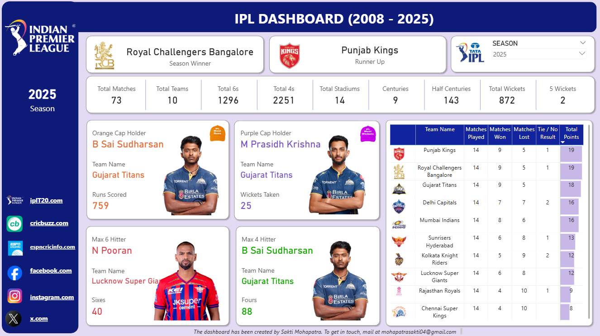

# IPL-Dashboard

# IPL Analytics Dashboard (2008–2025)

**An end-to-end Power BI case study** — from raw ball-by-ball data to an interactive tournament dashboard covering 18 seasons of the Indian Premier League.



---

## 1. Business Context

IPL data is scattered across delivery-level logs, match summaries, and player/team metadata — none of it analysis-ready on its own. The objective of this project was to consolidate that into a **single, season-aware dashboard** that answers the questions a fan, analyst, or franchise stakeholder actually asks:

- Who won this season, and who were the standout performers (Orange Cap, Purple Cap)?
- How does one season compare to another on scoring, wickets, and match volume?
- Where does each team stand in the points table, and how close was the race?

The dashboard is built to answer all three **without touching raw data** — every visual updates off a single season slicer.

## 2. Data Architecture & Flow

```
Raw Sources (CSV)                Power Query (ETL)              Data Model              Power BI Report
─────────────────                ─────────────────              ───────────              ───────────────
ball_by_ball_data.csv   ──┐                                    ┌─ Fact: Deliveries
ipl_matches_data.csv    ──┼──►  Clean → Type-cast → Merge  ──► │
players-data-updated.csv──┤        (NULL handling,             ├─ Dim: Matches          ──► Season Slicer
teams_data.csv          ──┘      derived columns, joins)       ├─ Dim: Players             ↓
                                                                 └─ Dim: Teams          Cards / Tables / KPIs
```

**Grain of each source:**

| Source | Grain | Rows | Role in model |
|---|---|---|---|
| `ball_by_ball_data.csv` | One row per delivery bowled | ~278,000 | Fact table |
| `ipl_matches_data.csv` | One row per match | ~1,169 | Dimension (match context) |
| `players-data-updated.csv` | One row per player | ~772 | Dimension (player attributes) |
| `teams_data.csv` | One row per franchise | 16 | Dimension (team branding/lookup) |

The ball-by-ball fact table is the workhorse — every KPI on the dashboard (runs, wickets, sixes, fours, centuries) is derived from it, filtered and sliced through its relationships to the three dimension tables.

## 3. Data Modeling

Built as a **star schema** in Power BI:

- **Fact — Deliveries** (`ball_by_ball_data`): batter, bowler, runs, extras, wicket details, keyed to `match_id` and `season_id`
- **Dim — Matches** (`ipl_matches_data`): joined to the fact table on `match_id`; carries season, venue, toss, and result context
- **Dim — Players** (`players-data-updated`): joined via player name matching (the fact table logs batters/bowlers by name, not `player_id`) to pull in batting/bowling style and images for the cap-holder and max-hitter cards
- **Dim — Teams** (`teams_data`): joined to both the fact table (`team_batting`/`team_bowling`) and the match table (`team1`/`team2`/`match_winner`) to standardize team names and pull in logos

**Modeling challenge:** the fact table references players and teams by name, not surrogate key, and franchise names change across seasons (e.g., Delhi Daredevils → Delhi Capitals, Rising Pune Supergiant only played 2016–17). This was resolved during the Power Query stage with mapping tables to unify historical team name variants before establishing relationships — otherwise season-over-season team comparisons would silently fragment.

## 4. Data Cleaning & Transformation (Power Query)

- Standardized inconsistent team name variants across seasons into a single canonical name per franchise
- Handled `NULL` values across dismissal fields (`player_out`, `wicket_kind`, `fielders_involved`) — most deliveries have no wicket, so nulls needed explicit handling rather than filtering rows out
- Converted extras logic (wide, no-ball, leg-bye, bye, penalty) into a single derived **"legal delivery"** flag, since over/ball counts depend on excluding wides and no-balls
- Cast `match_date` to a proper date type and derived `season` as a clean numeric field for slicing
- De-duplicated player metadata where the same player appears under slightly different name spellings across seasons

## 5. KPI Development (DAX)

Every card on the dashboard is a season-dynamic DAX measure, not a static value. Representative logic:

```DAX
Total Sixes =
CALCULATE(
    COUNTROWS('Deliveries'),
    'Deliveries'[batter_runs] = 6
)

Orange Cap Holder =
CALCULATE(
    TOPN(1, VALUES('Deliveries'[batter]), [Total Runs], DESC)
)

Total Points =
VAR Wins = CALCULATE(COUNTROWS('Matches'), 'Matches'[match_winner] = SELECTEDVALUE('Teams'[team_name]))
VAR Ties = CALCULATE(COUNTROWS('Matches'), 'Matches'[result] = "tie")
RETURN (Wins * 2) + (Ties * 1)
```

This pattern — rank-based `TOPN`/`RANKX` measures for cap holders and max-hitters, `CALCULATE` with filter context for count-based KPIs — is what lets a single season slicer drive every card, table, and player photo on the page simultaneously.

## 6. Dashboard Design & UX

Design decisions were made around **one-glance readability**:

- **Season slicer isolated top-right** — the single control that drives the entire page, kept visually separate from KPI cards so it reads as "the dial," not another metric
- **Player cards with photos** (Orange Cap, Purple Cap, Max Six-hitter, Max Four-hitter) rather than plain text — recognition is faster with a face and jersey than a name in a table
- **Points table sorted and color-banded** by total points so season standings are scannable without reading every row
- **KPI strip at the top** (matches, teams, sixes, fours, stadiums, centuries, half-centuries, wickets, five-wicket hauls) gives tournament-wide context before drilling into season specifics

## 7. Key Insights Surfaced (2025 season, as example)

- Royal Challengers Bangalore won the season; Punjab Kings were runners-up
- B Sai Sudharsan led both the Orange Cap race (759 runs) and max four-hitting (88 fours) — a double signal of consistent, boundary-heavy scoring
- M Prasidh Krishna's 25 wickets led the Purple Cap race, both from Gujarat Titans — suggesting a team built around a small core of standout individual performances
- The points table shows a tight top of the table (Punjab Kings and RCB both on 19 points) versus a clear bottom tier (Chennai Super Kings, 8 points) — a season with a compressed playoff race and a decisive relegation-zone gap

## 8. Challenges & How They Were Solved

| Challenge | Solution |
|---|---|
| Franchise names change across seasons (e.g., Delhi Daredevils → Delhi Capitals) | Built a name-mapping table in Power Query before modeling relationships |
| Fact table joins to players/teams by name, not ID | Cleaned and standardized name fields on both sides before merging |
| Every KPI needed to be season-dynamic, not static | Used `CALCULATE` + slicer filter context instead of hardcoded aggregations |
| `.pbix` files aren't Git-diffable | Committed a dashboard screenshot alongside the file so the repo is browsable without Power BI Desktop |

## Tech Stack

- **Power BI** — data modeling, DAX, report design
- **Power Query (M)** — ETL: cleaning, type-casting, name-mapping joins
- **DAX** — dynamic KPI and ranking measures


## Author

**Sakti Mohapatra**
mohapatrasakti04@gmail.com
